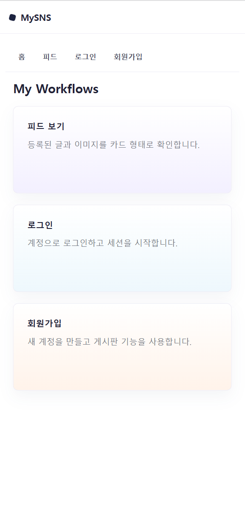
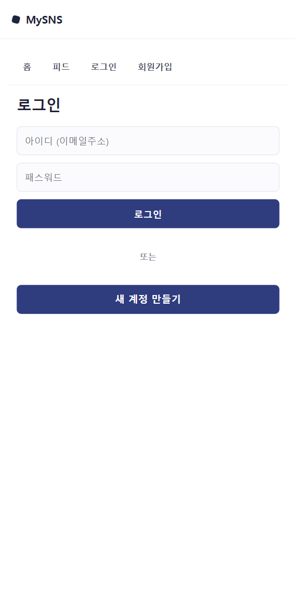
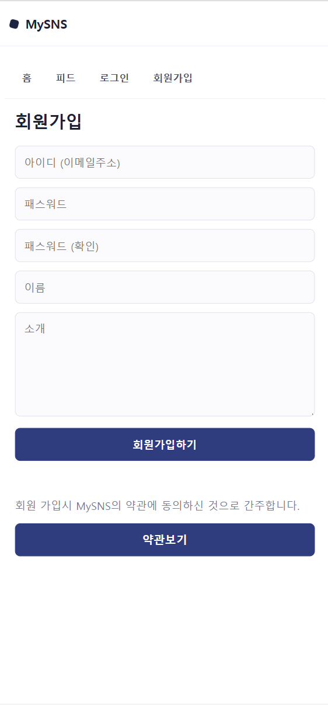
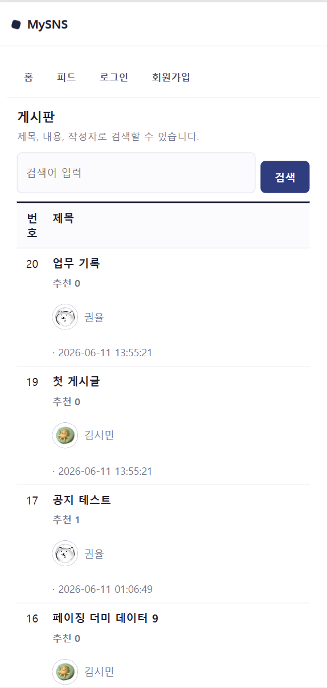
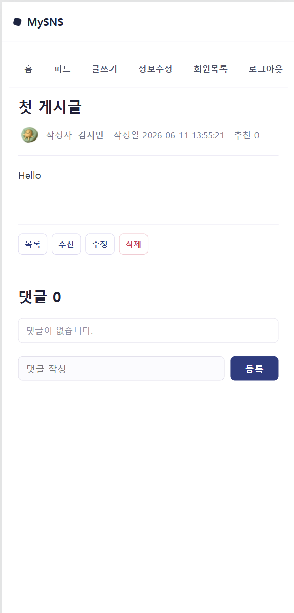
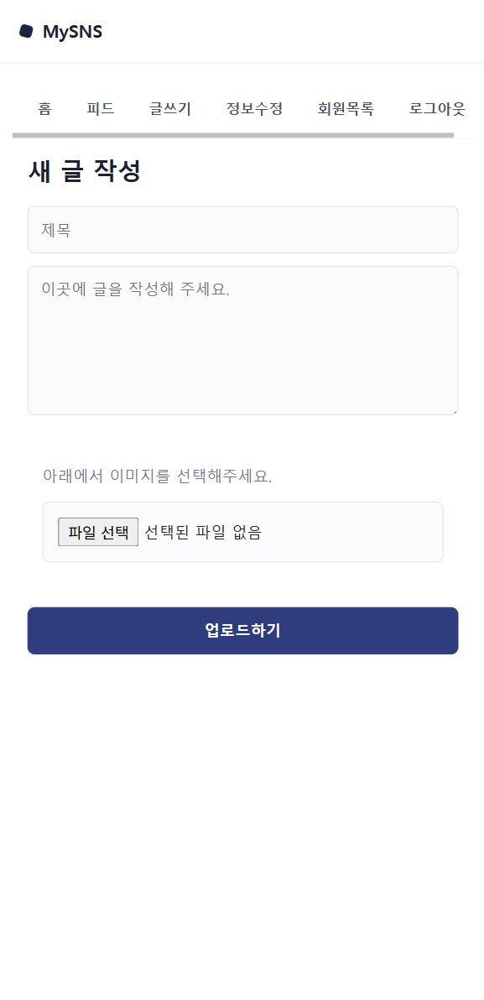
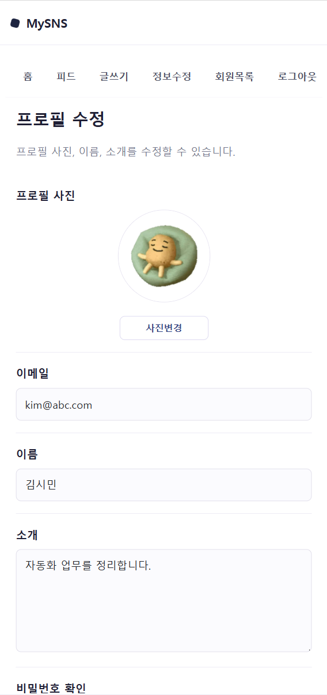

# MySNS

JSP, DAO, MySQL을 사용해 구현한 SNS형 게시판 웹 애플리케이션입니다.

회원가입, 로그인, 게시글 작성, 이미지 첨부, 댓글, 회원 정보 수정, 회원 탈퇴 기능을 제공합니다.

## 프로젝트 이미지

MySNS 주요 화면 구성입니다.


| 홈 | 로그인 | 회원가입 |
|----|--------|----------|
|  |  |  |

| 피드 목록 | 게시글 상세 | 글쓰기 |
|-----------|-------------|--------|
|  |  |  |

| 정보수정 | 로그아웃 |
|----------|----------|
|  |  |


## 팀소개

| 이름 | GitHub | 역할 |
|------|--------|------|
| EUNTELLA | [@EUNTELLA](https://github.com/EUNTELLA) | 프로젝트 구현 |
| LeeSangWook00 | [@LeeSangWook00](https://github.com/LeeSangWook00) | 프로젝트 구현 |


## 프로젝트 개요

MySNS는 교재 예제 구조를 기반으로 JSP 화면과 Java DAO 클래스를 분리해 구현한 게시판 서비스입니다.

사용자는 회원가입 후 로그인할 수 있으며, 게시글을 작성하고 이미지 파일을 첨부할 수 있습니다. 게시글 목록에서는 제목, 작성자, 댓글 수를 확인할 수 있고, 검색과 페이징 기능을 통해 게시글을 탐색할 수 있습니다.

### 주요 기능

- 회원가입, 로그인, 로그아웃
- 회원 정보 수정, 소개글 수정, 회원 탈퇴
- 게시글 작성, 목록 조회, 상세보기, 수정, 삭제
- 게시글 제목, 내용, 작성자 기준 검색
- 게시글 목록 페이징
- 이미지 파일 업로드
- 댓글 작성, 목록 조회, 삭제
- 게시글 목록에서 작성자 이름과 댓글 수 표시
- 로그인 상태에 따른 메뉴 변경
- 모바일 화면 기준 UI 구성

## 기술 스택

| 분야 | 기술 |
|------|------|
| 언어 | Java, JSP, HTML, CSS |
| 서버 | Apache Tomcat 9 |
| 데이터베이스 | MySQL |
| DB 연결 | JNDI DataSource, JDBC |
| 파일 업로드 | Apache Commons FileUpload, Apache Commons IO |
| JDBC 드라이버 | MySQL Connector/J |
| IDE | Eclipse Dynamic Web Project, VS Code |
| 빌드 출력 | `build/classes` |

## 빠른 시작

### 사전 요구사항

- Java 20
- Apache Tomcat 9
- MySQL
- MySQL Connector/J
- Apache Commons FileUpload
- Apache Commons IO

필요한 라이브러리 jar 파일은 `src/main/webapp/WEB-INF/lib`에 포함되어 있습니다.

### DB 생성

MySQL에서 아래 SQL을 실행합니다.

```sql
SOURCE src/main/webapp/SQL/mysns.sql;
SOURCE src/main/webapp/SQL/data.sql;
```

페이징 테스트용 더미 데이터가 필요하면 추가로 실행합니다.

```sql
SOURCE src/main/webapp/SQL/dummy.sql;
```

기존 DB를 사용하는 경우에는 마이그레이션 SQL을 실행합니다.

```sql
SOURCE src/main/webapp/SQL/migrate.sql;
```

### Tomcat JNDI 설정

이 프로젝트는 다음 JNDI 이름으로 DB 커넥션을 가져옵니다.

```text
java:comp/env/jdbc/mysns
```

Tomcat의 `conf/context.xml`에 아래 Resource 설정을 추가합니다.

```xml
<Resource
    name="jdbc/mysns"
    auth="Container"
    type="javax.sql.DataSource"
    driverClassName="com.mysql.cj.jdbc.Driver"
    url="jdbc:mysql://localhost:3306/mysns?serverTimezone=Asia/Seoul&amp;characterEncoding=UTF-8"
    username="root"
    password="본인_MySQL_비밀번호"
    maxTotal="20"
    maxIdle="10"
    maxWaitMillis="-1" />
```

### Eclipse에서 실행

1. Eclipse에서 프로젝트를 가져옵니다.

```text
File > Import > Existing Projects into Workspace
```

2. Tomcat 서버에 프로젝트를 추가합니다.

```text
Servers 탭 > Tomcat v9.0 > Add and Remove > PBL_JSP 추가
```

3. 브라우저에서 접속합니다.

```text
http://localhost:8080/PBL_JSP/index.html
```

### VS Code에서 실행

1. VS Code에서 프로젝트 폴더를 엽니다.

```text
C:\Users\USER\eclipse-workspace\PBL_JSP
```

2. 아래 확장을 설치합니다.

- Extension Pack for Java
- Community Server Connectors 또는 Tomcat for Java

3. Servers 패널에서 Tomcat 9 서버를 등록합니다.
4. 프로젝트의 `src/main/webapp`을 Tomcat에 배포합니다.
5. Context path를 `/PBL_JSP`로 설정합니다.
6. 브라우저에서 접속합니다.

```text
http://localhost:8080/PBL_JSP/index.html
```

### 테스트 계정

`data.sql`을 실행한 경우 아래 계정을 사용할 수 있습니다.

| 아이디 | 비밀번호 |
|--------|----------|
| `kim@abc.com` | `111` |
| `lee@abc.com` | `111` |
| `kwon@abc.com` | `111` |

## 프로젝트 구조

```text
PBL_JSP
├── README.md
├── makeread.md
├── src
│   └── main
│       ├── image
│       │   ├── edit.png
│       │   ├── feed.png
│       │   ├── feedadd.png
│       │   ├── home.png
│       │   ├── login.png
│       │   ├── loginmenubar.png
│       │   └── signup.png
│       ├── java
│       │   ├── dao
│       │   │   ├── UserDAO.java
│       │   │   ├── UserObj.java
│       │   │   ├── FeedDAO.java
│       │   │   ├── FeedObj.java
│       │   │   ├── ReplyDAO.java
│       │   │   └── ReplyObj.java
│       │   └── util
│       │       ├── ConnectionPool.java
│       │       └── FileUtil.java
│       └── webapp
│           ├── index.html
│           ├── css
│           │   └── core.css
│           ├── html
│           │   ├── login.html
│           │   ├── signup.html
│           │   ├── feedAdd.html
│           │   └── withdraw.html
│           ├── jsp
│           │   ├── login.jsp
│           │   ├── logout.jsp
│           │   ├── signup.jsp
│           │   ├── update.jsp
│           │   ├── withdraw.jsp
│           │   ├── main.jsp
│           │   ├── feedAdd.jsp
│           │   ├── feedEdit.jsp
│           │   ├── feedUpdate.jsp
│           │   ├── feedDelete.jsp
│           │   ├── replyAdd.jsp
│           │   ├── replyDelete.jsp
│           │   └── followingList.jsp
│           ├── SQL
│           │   ├── mysns.sql
│           │   ├── data.sql
│           │   ├── dummy.sql
│           │   └── migrate.sql
│           └── WEB-INF
│               └── lib
└── build
    └── classes
```

## 실행 시 주의사항

- JSP 파일은 직접 열지 말고 반드시 Tomcat 주소로 접속해야 합니다.
- 잘못된 접속 예: `file:///C:/Users/USER/eclipse-workspace/PBL_JSP/src/main/webapp/html/login.html`
- 올바른 접속 예: `http://localhost:8080/PBL_JSP/html/login.html`
- Java class 버전 오류가 발생하면 Tomcat 실행 JRE와 프로젝트 컴파일 버전을 Java 20으로 맞춥니다.
